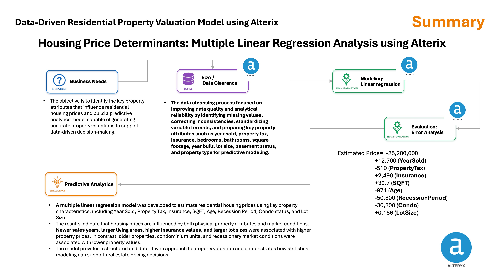
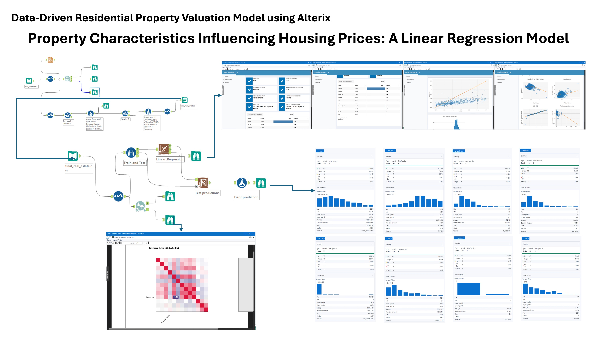
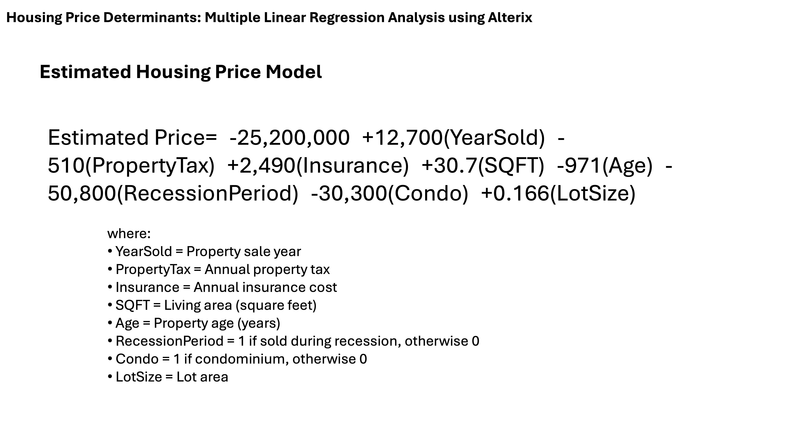

House_Price_Prediction_Using_Alterix

# Leveraging Alteryx Designer to identify key drivers of residential housing prices through data preparation, predictive modeling, and regression analysis, enabling data-driven property valuation decisions. 

This study aims to identify the key property characteristics that influence residential housing prices and to develop an interpretable predictive model using Alteryx Designer. A structured housing dataset containing 1,883 property records was cleansed to address missing values, outliers and inconsistent formats. Exploratory data analysis (EDA) was performed using Pearson correlation to assess relationships between features and sale price. Multiple linear regression was used to model sale price as a function of year sold, property tax, insurance cost, number of bedrooms and bathrooms, living area (SQFT), year built, lot size, basement status and property type. The resulting model achieved a mean absolute percentage error (MAPE) of approximately 15 % on the hold‑out set. The equation is presented along with feature importance rankings and residual analyses to support data‑driven valuation decisions.

Figure 1. Summary of Data-Driven Residential Property Valuation Model using Alterix

Figure 2. Procedure and Result on Alterix Program (Alterix Designer) 

Figure 3. Predictive Modeling: Linear Regression

## Conclusion
This project demonstrates how Alteryx Designer can be used to integrate data cleansing, exploratory analysis and regression modeling to predict residential housing prices. The multiple linear regression model achieved satisfactory predictive performance while maintaining interpretability. Key drivers of price include the sale year, living area, property tax, insurance cost and recession status. However, nonlinearities and complex interactions may limit the performance of linear models in capturing extreme cases. 

* A multiple linear regression model was developed to estimate residential housing prices using key property characteristics, including Year Sold, Property Tax, Insurance, SQFT, Age, Recession Period, Condo status, and Lot Size.
* The results indicate that housing prices are influenced by both physical property attributes and market conditions. Newer sales years, larger living areas, higher insurance values, and larger lot sizes were associated with higher property prices. In contrast, older properties, condominium units, and recessionary market conditions were associated with lower property values.

